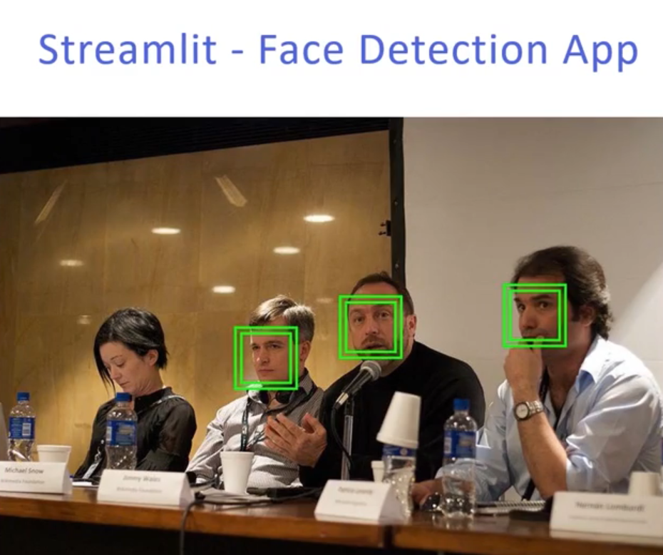

  
 

<i>
  <h2> <i> Face Detection App </i> </h2>

<i> For Face detection App there are many ways to implement this and for various You could build a model from scratch and train of lots of images that have faces, or you could use a pretrained model and work on images. We will be using Haar cascade classifier that are based on machine learning approach.

 
  
  <h2> <i>Image Classification </i> </h2>

<i>Image classification refers to the task of extracting information classes from a multiband raster image Depending on the interaction between the analyst and the computer during classification, there are two types of classification: supervised and unsupervised We will be working with supervised image classification

 

  <h2> Details of the Project </h2>

The Project is divided into three parts:  

1. Using classes like mobilenets for image classification  

2- Building our own model for image classification  

3. We build a web app with flask to mount the prediction model  

  
  
<h2> <i>Machine Learning Model </i> </h2>

<i>So we start off with preprocessing the model using ImageDataGenerator class and then move forward with training our model 

     
  
  <h2> <i>Flask Web App  </i> </h2>

<i>SThis is the second part where we build the web application using the framework Flask We mount the model we build in the previous part on the Flask project

     
  
  
  <h1> Screenshots </h1>
  <h2> Input Screen </h2>
 
   
   
   
   
  
    
  
<h2> Output Screen </h2> 

   
    

### Give It a Star if you liked the project 
